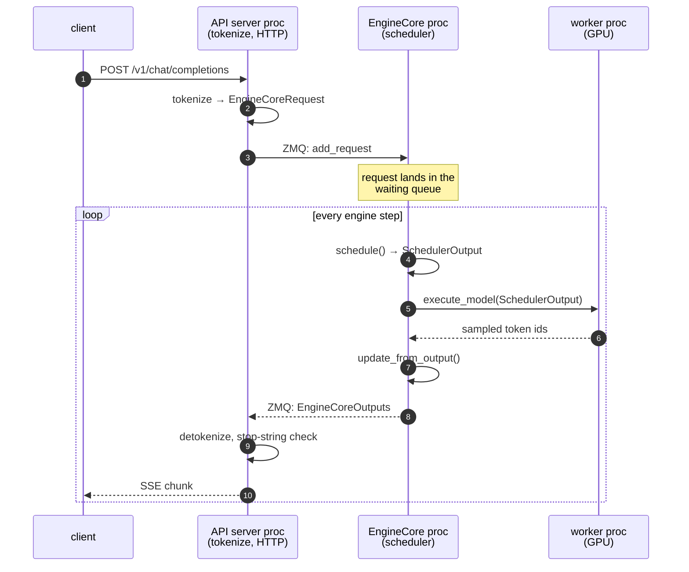
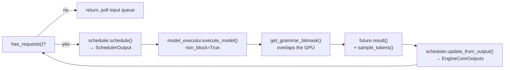

There's a comment sitting above vLLM's main scheduling loop that explains the engine better than any architecture diagram of it:

> There's no "decoding phase" nor "prefill phase" in the scheduler. Each request just has the `num_computed_tokens` and `num_tokens_with_spec`. […] At each step, the scheduler tries to assign tokens to the requests so that each request's `num_computed_tokens` can catch up its `num_tokens_with_spec`.
>
> — [`vllm/v1/core/sched/scheduler.py:429-438`](https://github.com/vllm-project/vllm/blob/6a1acac3fe2924ca221fdf048b74f9a020dabddd/vllm/v1/core/sched/scheduler.py#L429-L438)

Prefill and decode are the two words every explanation of LLM inference is built on, mine included. They name nothing in vLLM's scheduler. There is a counter per request and a token budget per step, and the phases are what you get when you plot the result.

That gap — between the model everyone teaches and the loop that actually runs — is why the engine looks like a black box from outside. This is the first of a series where I go through the V1 engine one component at a time, reading the code instead of the paper. The loop comes first because every other component hangs off it.

Everything below is pinned to [`6a1acac`](https://github.com/vllm-project/vllm/commit/6a1acac3fe2924ca221fdf048b74f9a020dabddd) on `main`, 1,469 commits past the `v0.23.1rc0` tag. Line numbers move; the SHA doesn't.

## The phases are real, but they aren't control flow

Start with what the two words are actually for, because they're not wrong — they name two shapes of matrix multiply.

You send a 2000-token prompt. To produce the first output token, the model has to compute attention keys and values for all 2000 positions. That's one forward pass with 2000 tokens in it. Each weight matrix gets read from HBM once and multiplied against a 2000-row activation matrix. The GPU is doing enough arithmetic per byte loaded to keep its tensor cores busy. That's **prefill**, and it's compute-bound.

Now the second output token. The keys and values for those 2000 positions are already sitting in GPU memory, so the model computes over exactly one new position. One forward pass, one token. Every weight matrix still gets read from HBM in full — all ~140 GB of them for a 70B model in bf16 — and gets multiplied against a *single row*. The arithmetic is trivial; the memory traffic is identical. That's **decode**, and it's memory-bandwidth-bound — on an H100 SXM it's the [3.35 TB/s](https://www.nvidia.com/en-us/data-center/h100/) of HBM bandwidth that sets the ceiling, not the tensor cores.

Two shapes, two bottlenecks, both real. The mistake is carrying that distinction up into your mental model of the scheduler and assuming the engine runs a prefill stage and then a decode stage. It doesn't. It runs one loop, and the loop counts tokens.

## One counter, one budget

Every request carries `num_computed_tokens` — how many of its tokens the model has KV entries for — and `num_tokens_with_spec`, which is `len(prompt) + len(output_so_far) + len(draft_tokens)`. The scheduler's entire job is closing that gap.

Each step it starts with a budget, [`token_budget = self.max_num_scheduled_tokens`](https://github.com/vllm-project/vllm/blob/6a1acac3fe2924ca221fdf048b74f9a020dabddd/vllm/v1/core/sched/scheduler.py#L447), which [falls back to `max_num_batched_tokens`](https://github.com/vllm-project/vllm/blob/6a1acac3fe2924ca221fdf048b74f9a020dabddd/vllm/v1/core/sched/scheduler.py#L110-L114) when you haven't set it. Then it walks the running queue first, and for each request asks for the gap, clipped:

```python
num_new_tokens = (
    request.num_tokens_with_spec
    + request.num_output_placeholders
    - request.num_computed_tokens
)
if 0 < self.scheduler_config.long_prefill_token_threshold < num_new_tokens:
    num_new_tokens = self.scheduler_config.long_prefill_token_threshold
num_new_tokens = min(num_new_tokens, token_budget)
```
<span class="src">[`scheduler.py:504-511`](https://github.com/vllm-project/vllm/blob/6a1acac3fe2924ca221fdf048b74f9a020dabddd/vllm/v1/core/sched/scheduler.py#L504-L511)</span>

A request that has generated 40 tokens and needs its 41st has a gap of 1, so it gets 1. A request that arrived this step with a 16,000-token prompt has a gap of 16,000, gets clipped to whatever budget is left, and comes back next step for the rest. Same three lines. The first case is what we call decode and the second is what we call chunked prefill, and the code does not distinguish them — chunked prefill isn't a feature bolted onto the loop, it's what `min(gap, budget)` does when the gap is large.

Running requests are served before waiting ones ([`scheduler.py:473`](https://github.com/vllm-project/vllm/blob/6a1acac3fe2924ca221fdf048b74f9a020dabddd/vllm/v1/core/sched/scheduler.py#L473) opens that loop; the waiting queue is drained afterwards with whatever budget survives). That ordering is the whole scheduling policy for the common case: keep everything already generating alive, then admit new work with the leftovers.



Read that diagram down a column, not across a row. A column is one `execute_model` call — one batch, one set of kernel launches. Column N+2 contains request A finishing its prompt with a 512-token chunk, request C starting a 7678-token chunk, and requests B and D contributing one token each. There is no step in that picture that is "a prefill step."

## Your request is a row in a matrix that changes every step

The other half of the black box is that nothing in the engine owns your request end to end. It's decomposed across two processes, and the boundary is worth knowing because it's where most operational surprises live.

The API server process does HTTP, tokenization, and multimodal loading; the engine core process runs the scheduler and drives the GPU workers; they talk over ZMQ ([`docs/design/arch_overview.md`](https://github.com/vllm-project/vllm/blob/6a1acac3fe2924ca221fdf048b74f9a020dabddd/docs/design/arch_overview.md#L82-L99)). That's not decoration. Separate processes mean separate GILs, so a burst of tokenization work in the frontend can't stall the loop that's feeding the GPU. It also means the thing you profile as "vLLM latency" is at least two queues deep.



The engine core side is a busy loop with two statements in it:

```python
def run_busy_loop(self):
    """Core busy loop of the EngineCore."""
    while self._handle_shutdown():
        # 1) Poll the input queue until there is work to do.
        self._process_input_queue()
        # 2) Step the engine core and return the outputs.
        self._process_engine_step()
```
<span class="src">[`core.py:1358-1364`](https://github.com/vllm-project/vllm/blob/6a1acac3fe2924ca221fdf048b74f9a020dabddd/vllm/v1/engine/core.py#L1358-L1364)</span>

And a step, in full ([`core.py:576-606`](https://github.com/vllm-project/vllm/blob/6a1acac3fe2924ca221fdf048b74f9a020dabddd/vllm/v1/engine/core.py#L576-L606)):



`SchedulerOutput` is the entire contract between the scheduler and the GPU: which requests, how many tokens each, which KV blocks they own. The worker doesn't know about queues or priorities. The scheduler doesn't know about kernels. That seam is why vLLM can swap attention backends and hardware platforms without touching scheduling logic — and it's the seam I'll follow in the next few posts.

Two details in `step()` are worth naming, because they're the kind of line you read straight through. `execute_model` is called with `non_block=True`, and the grammar bitmask for structured output is computed while the GPU is busy — CPU work deliberately overlapped with the forward pass. And aborts are drained *after* the model returns but *before* `update_from_output`, so a client that disconnects mid-step doesn't corrupt the accounting for the step already in flight.

## What the shape buys, and what it costs

The payoff for collapsing everything into one counter is that features that sound independent stop needing separate machinery. Chunked prefill is `min(gap, budget)`. Prefix caching is starting a request with `num_computed_tokens` already above zero. Speculative decoding is a gap of `1 + num_speculative_tokens` instead of 1, which is why `num_tokens_with_spec` and not `num_tokens` is the target in the first place. Three features, one subtraction.

The cost shows up in two places, and both are visible in the diagram.

**Preemption is amnesia.** When the KV cache runs out of blocks, the scheduler evicts a running request. [`_preempt_request`](https://github.com/vllm-project/vllm/blob/6a1acac3fe2924ca221fdf048b74f9a020dabddd/vllm/v1/core/sched/scheduler.py#L1203-L1225) frees its blocks, sets `request.num_computed_tokens = 0`, and prepends it to the waiting queue. There's no swap to host memory on this path — the KV cache for those tokens is gone, and the request re-prefills its entire context from scratch. That's request D in the diagram paying 8189 tokens at step N+6 for tokens it had already computed by step N. If your p99 has a cliff under load, the counter declared as [`vllm:num_preemptions`](https://github.com/vllm-project/vllm/blob/6a1acac3fe2924ca221fdf048b74f9a020dabddd/vllm/v1/metrics/loggers.py#L661-L664) — `vllm:num_preemptions_total` once Prometheus suffixes it — is the first thing to look at, and the fix is usually more KV blocks or a lower `max_num_seqs`, not a bigger batch.

**Decode-only steps waste almost the entire budget.** Steps N+4 and N+7 schedule 3 and 4 tokens against a budget of 8192, and each one still pulls the model's whole active weight set out of HBM — every weight, in a dense model. Prefill work is what fills that gap, which is the real argument for chunked prefill: not that long prompts get chopped up, but that the chopped pieces ride along in steps that were going to be memory-bound anyway.

That budget number isn't arbitrary either, and the way it's chosen is a small lesson in not trusting defaults:

```python
if device_memory >= 70 * GiB_bytes and "a100" not in device_name:
    # For GPUs like H100 and MI300x, use larger default values.
    default_max_num_batched_tokens = {
        UsageContext.LLM_CLASS: 16384,
        UsageContext.OPENAI_API_SERVER: 8192,
    }
```
<span class="src">[`arg_utils.py:2478-2483`](https://github.com/vllm-project/vllm/blob/6a1acac3fe2924ca221fdf048b74f9a020dabddd/vllm/engine/arg_utils.py#L2478-L2483)</span>

Same GPU class, but the offline `LLM` path gets twice the budget the OpenAI server gets, because the server is optimizing for time-to-first-token and the offline path for throughput. And the A100 is carved out of the large default by a substring match on the device name, because raising the budget there *lowered* throughput — [PR #17885](https://github.com/vllm-project/vllm/pull/17885) measured Llama-3.1-70B at TP=2 going from 1054 to 1438 tok/s (+36%) by making the batch smaller. One `if` statement, three different answers, none of them in the flag's help text.

## What to carry into the rest of the series

If you take one thing from the loop: **your request is not a unit of work in vLLM, it's a row in a batch that is re-formed from scratch on every step.** The engine holds no plan for it. Each step it re-decides who runs, and the only state carried forward is a counter and a set of KV blocks.

That reframing is what makes the rest of the system readable. "How much memory does my request use" becomes a question about the block pool. "Why did TTFT spike" becomes a question about how many steps your prompt waited for budget. "Why is my prefix cache not hitting" becomes a question about block hashes, which is the next post — the block pool and the flat dict that vLLM calls a prefix cache, and why it isn't the radix tree you're picturing.
