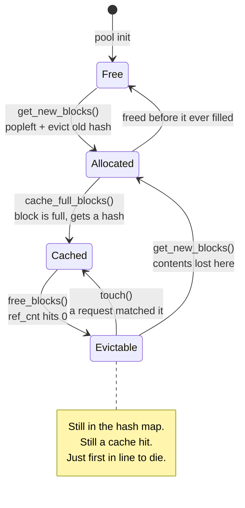

In [part 1](/series/inside-vllm/there-is-no-prefill-phase/) I wrote this:

> **Preemption is amnesia.** […] the KV cache for those tokens is gone, and the request re-prefills its entire context from scratch.

The first half is right and the second half is wrong. A preempted request usually gets most of its context back for free, and the reason is the most useful thing in the block pool: **freeing a block does not uncache it.**

Prefix caching is on by default ([`config/cache.py:93`](https://github.com/vllm-project/vllm/blob/6a1acac3fe2924ca221fdf048b74f9a020dabddd/vllm/config/cache.py#L93)), so this is the path almost everyone is actually running. Chasing down why I was wrong is the cleanest way into the block pool, so that's this post: what a free block actually is, why eviction needs no bookkeeping at all, and what preemption really costs.

Same pin as part 1 — [`6a1acac`](https://github.com/vllm-project/vllm/commit/6a1acac3fe2924ca221fdf048b74f9a020dabddd).

## Freeing decrements a counter

Here is the whole of what happens when a request gives its blocks back:

```python
for block in ordered_blocks:
    block.ref_cnt -= 1
    if block.ref_cnt == 0 and not block.is_null:
        if block.block_hash is None:
            blocks_without_hash.append(block)
        else:
            blocks_with_hash.append(block)

# Blocks without hash always get evicted first - prepend them last to the tail
self.free_block_queue.prepend_n(blocks_without_hash)
self.free_block_queue.append_n(blocks_with_hash)
```
<span class="src">[`block_pool.py:730-740`](https://github.com/vllm-project/vllm/blob/6a1acac3fe2924ca221fdf048b74f9a020dabddd/vllm/v1/core/block_pool.py#L730-L740)</span>

Count the things that don't happen. `cached_block_hash_to_block` — the hash → block map that *is* the prefix cache — is never touched. `block.block_hash` is never reset. Nothing is zeroed, nothing is emitted. The block keeps its identity and stays findable by any request whose tokens hash to the same value. All "free" means is that nobody currently holds a reference, so the memory is *available* if someone needs it.

A block only truly loses its contents in [`get_new_blocks`](https://github.com/vllm-project/vllm/blob/6a1acac3fe2924ca221fdf048b74f9a020dabddd/vllm/v1/core/block_pool.py#L647-L677), at the moment somebody claims the memory:

```python
ret: list[KVCacheBlock] = self.free_block_queue.popleft_n(num_blocks)

if self.enable_caching:
    for block in ret:
        self._maybe_evict_cached_block(block)
```

Eviction is lazy and it is a side effect of allocation. There is no reaper, no watermark, no background pass. A cached block stays a valid cache entry right up until the instant its memory is handed to someone else.

## The queue is the policy

So which block gets sacrificed? Whichever one is at the head. That's it — that's the entire eviction policy.

Allocation is `popleft_n`, freeing is `append_n`, and approximate LRU falls out of insertion order without anyone tracking a timestamp or maintaining a heap. The class docstring states the intended ordering outright:

> The queue is ordered by block ID in the beginning. When a block is allocated and then freed, it will be appended back with the eviction order:
> 1. The least recent used block is at the front (LRU).
> 2. If two blocks have the same last accessed time (allocated by the same sequence), the one with more hash tokens (the tail of a block chain) is at the front.
>
> — [`FreeKVCacheBlockQueue`, `kv_cache_utils.py:184-204`](https://github.com/vllm-project/vllm/blob/6a1acac3fe2924ca221fdf048b74f9a020dabddd/vllm/v1/core/kv_cache_utils.py#L184-L204)



Two details in that ordering are load-bearing and neither is obvious.

**Unhashed blocks are prepended, not appended.** A block with no hash can never produce a cache hit — it's a partial block, or caching was off when it was filled. Keeping it anywhere but the front of the queue would mean sacrificing a block that *could* have been reused in order to preserve one that couldn't. So the useless blocks are spent first, deliberately.

**A request's blocks are freed backwards.** `free()` is one line, and the comment carries the design:

```python
# Free blocks in reverse order so that the tail blocks are freed first.
self.block_pool.free_blocks(reversed(self.pop_blocks_for_free(request_id)))
```
<span class="src">[`single_type_kv_cache_manager.py:495-503`](https://github.com/vllm-project/vllm/blob/6a1acac3fe2924ca221fdf048b74f9a020dabddd/vllm/v1/core/single_type_kv_cache_manager.py#L495-L503)</span>

Block 0 of a request holds the start of its prompt — the system prompt, the shared few-shot preamble, whatever every other request in the fleet also begins with. The last block holds the tail that is unique to this one conversation. Handing them over in reverse puts the unique tail nearest the head of the queue and the shared prefix furthest from it. When pressure comes, vLLM spends the block nobody else wants first. The `reversed()` is the entire mechanism, and it lives outside the queue class, which is why the docstring has to point at it.

The list is intrusive, too — `prev_free_block` and `next_free_block` are fields on `KVCacheBlock` itself ([`kv_cache_utils.py:117-137`](https://github.com/vllm-project/vllm/blob/6a1acac3fe2924ca221fdf048b74f9a020dabddd/vllm/v1/core/kv_cache_utils.py#L117-L137)), and the class exists rather than using `collections.deque` specifically "to support removing a block in the middle of the queue in O(1) time." That middle removal is `touch()`, and it's what a cache hit does: a request matches a block that was sitting in the free queue, and the block gets yanked out of the line and its ref count bumped. A free block isn't free if someone still wants it.



That `Evictable` state is the one I missed in part 1. It looks like death and it isn't.

## So what does preemption actually cost?

Walk the path. [`_preempt_request`](https://github.com/vllm-project/vllm/blob/6a1acac3fe2924ca221fdf048b74f9a020dabddd/vllm/v1/core/sched/scheduler.py#L1203-L1225) frees the request's blocks, sets `request.num_computed_tokens = 0`, and prepends it to the waiting queue. When the scheduler gets back to it, the waiting-queue path runs the same lookup a brand-new request gets:

```python
# Get already-cached tokens.
if request.num_computed_tokens == 0:
    ...
    ) = self.kv_cache_manager.get_computed_blocks(request)
```
<span class="src">[`scheduler.py:718-739`](https://github.com/vllm-project/vllm/blob/6a1acac3fe2924ca221fdf048b74f9a020dabddd/vllm/v1/core/sched/scheduler.py#L718-L739)</span>

The request still carries its `block_hashes`. Its blocks are still in the map. Zeroing `num_computed_tokens` isn't erasure — it's what *forces the re-lookup*, and the re-lookup is what hands the context back. If nothing evicted those blocks while the request waited, it resumes having recomputed almost nothing.

Almost. Two things you still pay:

The scheduler has to re-derive the hit, and `get_computed_blocks` caps the match at `request.num_tokens - 1` — "when all tokens hit the cache, we must recompute the last token to obtain logits" ([`kv_cache_manager.py:249-255`](https://github.com/vllm-project/vllm/blob/6a1acac3fe2924ca221fdf048b74f9a020dabddd/vllm/v1/core/kv_cache_manager.py#L249-L255)). Since `allocate_slots` needs block-aligned computed tokens, a full hit can cost you a whole recomputed block rather than one token.

And the real one: **whatever got evicted while you were waiting.** This is where the honest version of my part-1 claim lives. Preemption fires because the pool ran out of blocks. Running out of blocks is exactly the condition under which `get_new_blocks` walks the head of the free queue evicting cache entries. The two events aren't independent — the pressure that preempted you is the same pressure chewing through your freed blocks, starting with your unique tail and working toward the shared prefix.

So the cost is a spectrum, not a constant. Preempted in a lull, you lose a block. Preempted in a sustained overload where every step is claiming fresh memory, your blocks get walked and you really do re-prefill. My part-1 sentence described the worst case as though it were the only case.

## What to do with this

`vllm:num_preemptions` on its own tells you an event happened, not what it cost — and I said in part 1 it was the first counter to check, which is only half an answer. Pair it with `vllm:prefix_cache_hits` and `vllm:prefix_cache_queries`. Preemptions climbing while the hit rate holds means requests are bouncing but recovering; that's survivable and mostly shows up as latency jitter. Preemptions climbing *with* the hit rate falling is the bad one — the pool is churning fast enough to evict what it just freed, and every preemption is now a real re-prefill.

The knob is the same either way, and it isn't the batch size. It's blocks: raise `gpu_memory_utilization`, or cut `max_num_seqs` so fewer requests are holding blocks at once. Which is a question about how many blocks you get in the first place, and how vLLM decides that number — a profiling run, a memory measurement, and some block-size arithmetic that hybrid Mamba models make surprisingly awkward. That's part 3.
